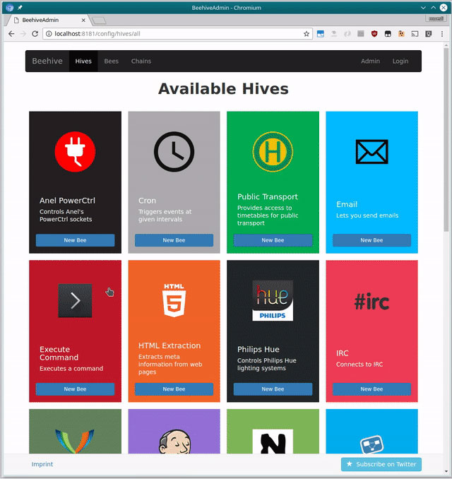

<!--
N.B.: This README was automatically generated by <https://github.com/YunoHost/apps/tree/master/tools/readme_generator>
It shall NOT be edited by hand.
-->

# Beehive for YunoHost

[](https://ci-apps.yunohost.org/ci/apps/beehive/)  

[](https://install-app.yunohost.org/?app=beehive)

*[Read this README in other languages.](./ALL_README.md)*

> *This package allows you to install Beehive quickly and simply on a YunoHost server.*  
> *If you don't have YunoHost, please consult [the guide](https://yunohost.org/install) to learn how to install it.*

## Overview

Beehive is an event and agent system, which allows you to create your own agents that perform automated tasks triggered by events and filters. It is modular, flexible and really easy to extend for anyone. It has modules (we call them Hives), so it can interface with, talk to, or retrieve information from Twitter, Tumblr, Email, IRC, Jabber, RSS, Jenkins, Hue - to name just a few. 

### Features:

- Re-post tweets on your Tumblr blog
- Forward incoming chat messages to your email account
- Turn on the heating system if the temperature drops below a certain value
- Run your own IRC bot that lets you trigger builds on a Jenkins CI
- Control your Hue lighting system
- Notify you when a stock's price drops below a certain value


**Shipped version:** 0.4.0~ynh4

**Demo:** <https://github.com/muesli/beehive/wiki/Available-Hives>

## Screenshots



## :red_circle: Antifeatures

- **Upstream not maintained**: This software is not maintained anymore. Expect it to break down over time, be exposed to unfixed security breaches, etc.

## Documentation and resources

- Upstream app code repository: <https://github.com/muesli/beehive>
- YunoHost Store: <https://apps.yunohost.org/app/beehive>
- Report a bug: <https://github.com/YunoHost-Apps/beehive_ynh/issues>

## Developer info

Please send your pull request to the [`testing` branch](https://github.com/YunoHost-Apps/beehive_ynh/tree/testing).

To try the `testing` branch, please proceed like that:

```bash
sudo yunohost app install https://github.com/YunoHost-Apps/beehive_ynh/tree/testing --debug
or
sudo yunohost app upgrade beehive -u https://github.com/YunoHost-Apps/beehive_ynh/tree/testing --debug
```

**More info regarding app packaging:** <https://yunohost.org/packaging_apps>
