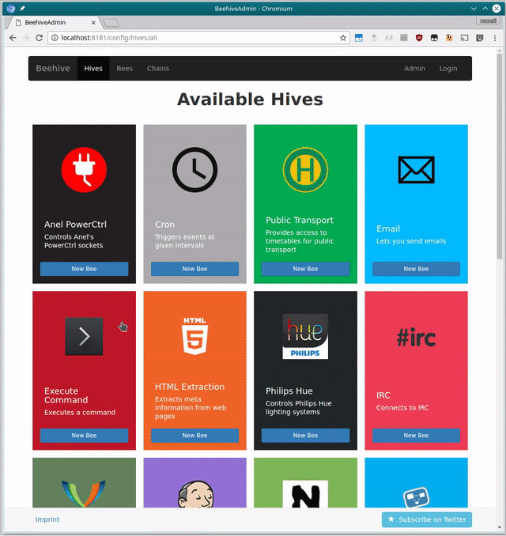

<!--
Ohart ongi: README hau automatikoki sortu da <https://github.com/YunoHost/apps/tree/master/tools/readme_generator>ri esker
EZ editatu eskuz.
-->

# Beehive YunoHost-erako

[](https://ci-apps.yunohost.org/ci/apps/beehive/)  

[](https://install-app.yunohost.org/?app=beehive)

*[Irakurri README hau beste hizkuntzatan.](./ALL_README.md)*

> *Pakete honek Beehive YunoHost zerbitzari batean azkar eta zailtasunik gabe instalatzea ahalbidetzen dizu.*  
> *YunoHost ez baduzu, kontsultatu [gida](https://yunohost.org/install) nola instalatu ikasteko.*

## Aurreikuspena

Beehive is an event and agent system, which allows you to create your own agents that perform automated tasks triggered by events and filters. It is modular, flexible and really easy to extend for anyone. It has modules (we call them Hives), so it can interface with, talk to, or retrieve information from Twitter, Tumblr, Email, IRC, Jabber, RSS, Jenkins, Hue - to name just a few. 

### Features:

- Re-post tweets on your Tumblr blog
- Forward incoming chat messages to your email account
- Turn on the heating system if the temperature drops below a certain value
- Run your own IRC bot that lets you trigger builds on a Jenkins CI
- Control your Hue lighting system
- Notify you when a stock's price drops below a certain value


**Paketatutako bertsioa:** 0.4.0~ynh4

**Demoa:** <https://github.com/muesli/beehive/wiki/Available-Hives>

## Pantaila-argazkiak



## :red_circle: Ezaugarri zalantzagarriak

- **Jatorrizko garapena utzita**: Software honek ez du arduradunik. Denborak aurrera egin ahala funtzionatzeari utziko dio, konpondu gabeko segurtasun arazoak izango ditu, etab.

## Dokumentazioa eta baliabideak

- Jatorrizko aplikazioaren kode-gordailua: <https://github.com/muesli/beehive>
- YunoHost Denda: <https://apps.yunohost.org/app/beehive>
- Eman errore baten berri: <https://github.com/YunoHost-Apps/beehive_ynh/issues>

## Garatzaileentzako informazioa

Bidali `pull request`a [`testing` abarrera](https://github.com/YunoHost-Apps/beehive_ynh/tree/testing).

`testing` abarra probatzeko, ondorengoa egin:

```bash
sudo yunohost app install https://github.com/YunoHost-Apps/beehive_ynh/tree/testing --debug
edo
sudo yunohost app upgrade beehive -u https://github.com/YunoHost-Apps/beehive_ynh/tree/testing --debug
```

**Informazio gehiago aplikazioaren paketatzeari buruz:** <https://yunohost.org/packaging_apps>
