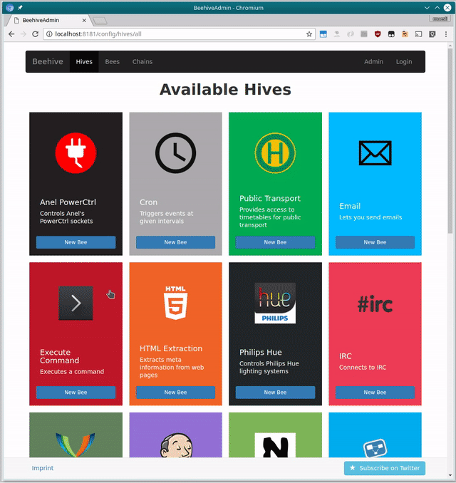

<!--
N.B.: This README was automatically generated by https://github.com/YunoHost/apps/tree/master/tools/README-generator
It shall NOT be edited by hand.
-->

# Beehive pour YunoHost

[](https://dash.yunohost.org/appci/app/beehive)  

[](https://install-app.yunohost.org/?app=beehive)

*[Read this readme in english.](./README.md)*

> *Ce package vous permet d’installer Beehive rapidement et simplement sur un serveur YunoHost.
Si vous n’avez pas YunoHost, regardez [ici](https://yunohost.org/#/install) pour savoir comment l’installer et en profiter.*

## Vue d’ensemble

Beehive is an event and agent system, which allows you to create your own agents that perform automated tasks triggered by events and filters. It is modular, flexible and really easy to extend for anyone. It has modules (we call them Hives), so it can interface with, talk to, or retrieve information from Twitter, Tumblr, Email, IRC, Jabber, RSS, Jenkins, Hue - to name just a few. 

### Features:

- Re-post tweets on your Tumblr blog
- Forward incoming chat messages to your email account
- Turn on the heating system if the temperature drops below a certain value
- Run your own IRC bot that lets you trigger builds on a Jenkins CI
- Control your Hue lighting system
- Notify you when a stock's price drops below a certain value


**Version incluse :** 0.4.0~ynh2

**Démo :** https://github.com/muesli/beehive/wiki/Available-Hives

## Captures d’écran



## Documentations et ressources

* Dépôt de code officiel de l’app : <https://github.com/muesli/beehive>
* Documentation YunoHost pour cette app : <https://yunohost.org/app_beehive>
* Signaler un bug : <https://github.com/YunoHost-Apps/beehive_ynh/issues>

## Informations pour les développeurs

Merci de faire vos pull request sur la [branche testing](https://github.com/YunoHost-Apps/beehive_ynh/tree/testing).

Pour essayer la branche testing, procédez comme suit.

``` bash
sudo yunohost app install https://github.com/YunoHost-Apps/beehive_ynh/tree/testing --debug
ou
sudo yunohost app upgrade beehive -u https://github.com/YunoHost-Apps/beehive_ynh/tree/testing --debug
```

**Plus d’infos sur le packaging d’applications :** <https://yunohost.org/packaging_apps>